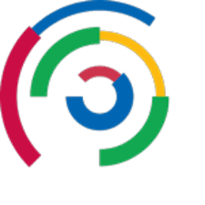
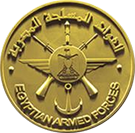

# Mostafa Mahmoud — Senior Unity Developer

<table>
  <tr>
    <td width="100" valign="top">
      
    </td>
    <td valign="top" style="padding-left: 15px;">
      

        📧 drshdrsh26@yahoo.com 
        Riyadh, Saudi Arabia 
        +201017800204
      

      

        <a href="https://eg.linkedin.com/in/mostafa-mahmoud-abdelrahman">LinkedIn</a> | 
        <a href="PORTFOLIO.md">Portfolio Website</a> | 
        <a href="your-youtube-channel">YouTube</a>
      

    </td>
  </tr>
</table>

---

## About Me

Experienced Senior Unity Developer with 7+ years in VR, multiplayer games, and simulation. Skilled in Unity (C#), Photon, Firebase, URP, Addressables, and editor tooling (Odin Inspector). Passionate about creating immersive, efficient, and scalable applications for mobile, VR, and web platforms. Strong communicator and agile team player.

---

## Skills

- Unity & C# (7+ years)
- Multiplayer Networking: Photon PUN & Fusion
- VR Development: Meta Quest, HTC Vive, PC VR
- Firebase: Auth, Realtime Database, Cloud Save
- Unity Systems: Addressables, URP
- Editor Tooling & Custom Inspectors (Odin Inspector)
- CI/CD pipelines for Unity projects (GitHub Actions)
- Agile Software Development

---

## Work Experience

**Senior Unity Developer**  
<a href="https://www.rmg-sa.com/" target="_blank">
  
    <strong>RMG, Riyadh, Saudi Arabia</strong>
    
  
</a>  
_Aug 2024 – Present_  
- Lead development of mobile multiplayer games and interactive experiences.

**Senior Unity Developer**  
<a href="https://arconme.com/" target="_blank">
  
    <strong>ARCON (Remote)</strong>
    
  
</a>  
_Apr 2022 – Jul 2024_  
- Developed educational simulation projects in Unity with a focus on clean, efficient C# code.

**Unity Developer (Part-time)**  
<a href="https://dev.global-business-strategies.com/" target="_blank">
  
    <strong>BlueZone Web</strong>
    
  
</a>  
_Oct 2021 – Feb 2024_  
- Created 3D multiplayer games using Unity, Photon-ML, and Firebase backend.

**Officer & C# Developer (Forced Conscription)**  
<a href="https://www.mod.gov.eg/ModWebSite/Default.aspx" target="_blank">
  
    <strong>Egyptian Armed Forces</strong>
    
  
</a>  
_May 2019 – Sep 2021_  
- Developed internal desktop C# applications including database and report systems.

**Unity Developer (Full-time)**  
<a href="https://b-vision.tech/" target="_blank">
  
    <strong>Bright Vision Tech</strong>
    
  
</a>  
_Jul 2018 – Apr 2021_  
- Built VR training simulations for firefighting, firearms, and driving.

**Project Reviewer / Classroom Mentor**  
<a href="https://www.udacity.com/" target="_blank">
  
    <strong>Udacity</strong>
    
  
</a>  
_Nov 2017 – Jun 2018_  
- Mentored and reviewed student projects, enhancing communication and mentoring skills.

---

## Education

**Bachelor’s Degree in Computer Science**  
_Benha University, Egypt_  
_Aug 2014 – Aug 2018_  
Specialized in Mobile Application Development

---

## Certificates & Language Skills

### Certificates

  
  

### Udacity Nanodegrees
- [Android Basics Nanodegree Certificate](https://www.udacity.com/certificate/X6S5TFLD)
- [Virtual Reality Nanodegree Certificate](https://www.udacity.com/certificate/CTNH7HQS)

---
### Language Skills

| Language | Proficiency        |
| -------- | -------------------|
| Arabic   | Native             |
| English  | Upper Intermediate |

---

## Projects & Media

### Multiplayer VR Training Simulator  
- **Role:** Lead Developer  
- **Technologies:** Unity, Photon Fusion, URP, Oculus Quest  
- **Demo Video:** [YouTube Link](your-demo-video-url)  
- **Source Code:** [GitHub Repo](your-project-repo-url)  

### Mobile Multiplayer Game  
- **Role:** Full-stack Developer  
- **Technologies:** Unity, Photon PUN, Firebase  
- **Demo Video:** [YouTube Link](your-demo-video-url)  
- **APK Download:** [Link](your-apk-download-url)  

### Custom Editor Tools (Odin Inspector)  
- **Role:** Tooling Developer  
- **Technologies:** Unity Editor Scripting, Odin Inspector  
- **Demo Video:** [YouTube Link](your-demo-video-url)  
- **Source Code:** [GitHub Repo](your-tooling-repo-url)  

---

## Contact

📞 +201017800204  
[📱 WhatsApp](https://wa.me/966560358978)

📧 drshdrsh26@yahoo.com  
[LinkedIn](https://eg.linkedin.com/in/mostafa-mahmoud-abdelrahman) | [Portfolio](PORTFOLIO.md)
